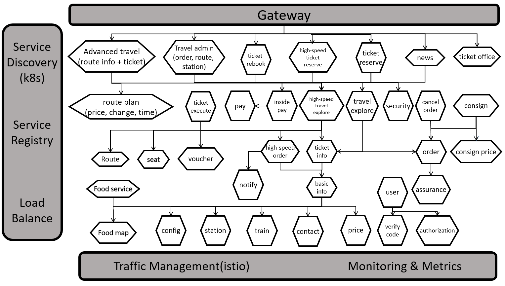
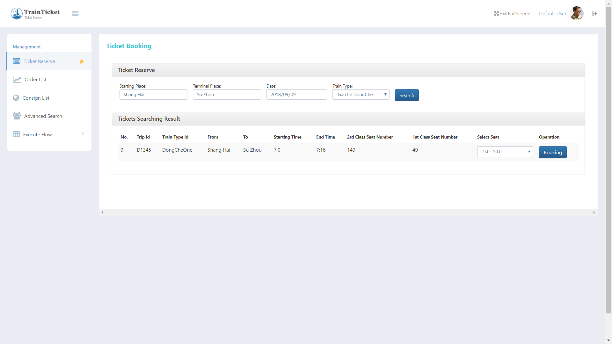

# Train Ticket：A Benchmark Microservice System

The project is a train ticket booking system based on microservice architecture which contains 41 microservices. The programming languages and frameworks it used are as below.
- Java - Spring Boot, Spring Cloud
- Node.js - Express
- Python - Django
- Go - Webgo
- DB - Mongo、MySQL

You can get more details at [Wiki Pages](https://github.com/FudanSELab/train-ticket/wiki).

## Service Architecture Graph


## Quick Start
We provide two options to quickly deploy our application: [Using Docker Compose](#Using-Docker-Compose) and [Using Kubernetes](#Using-Kubernetes).

### Using Docker Compose
The easiest way to get start with the Train Ticket application is by using [Docker](https://www.docker.com/) and [Docker Compose](https://docs.docker.com/compose/).

> If you don't have Docker and Docker Compose installed, you can refer to [the Docker website](https://www.docker.com/) to install them.

#### Presequisite
* Docker
* Docker Compose

#### 1. Clone the Repository
```bash
git clone --depth=1 https://github.com/FudanSELab/train-ticket.git
cd train-ticket/
```

#### 2. Start the Application
```bash
docker-compose -f deployment/docker-compose-manifests/quickstart-docker-compose.yml up
```
Once the application starts, you can visit the Train Ticket web page at [http://localhost:8080](http://localhost:8080).

### Using Kubernetes
Here is the steps to deploy the Train Ticket onto any existing Kubernetes cluster.

#### Presequisite
* An existing Kubernetes cluster

#### 1. Clone the Repository
```bash
git clone --depth=1 https://github.com/FudanSELab/train-ticket.git
cd train-ticket/
```

#### 2. Deploy the application
```bash
cd deployment/kubernetes-manifests/quickstart-k8s

# Deploy the databases
kubectl apply -f quickstart-ts-deployment-part1.yml
# Deploy the services
kubectl apply -f quickstart-ts-deployment-part2.yml
# Deploy the UI Dashboard
kubectl apply -f quickstart-ts-deployment-part3.yml
```

#### 3. Run `kubectl get pods` to see pods are in a ready state

#### 4. Visit the Train Ticket web page at [http://[Node-IP]:32677](http://[Node-IP]:32677).

### More Deployment Ways

There are many other quick deployment ways in [deployment folder](<https://github.com/FudanSELab/train-ticket/tree/master/deployment>).  For example, you can deploy this system [with Jaeger](<https://github.com/FudanSELab/train-ticket/tree/master/deployment/kubernetes-manifests/k8s-with-jaeger>), and then visit the Jaeger Webpage to view traces.

## Build From Source
In the above, We use pre-built images to quickly deploy the application.

If you want to build the application from source, you can refer to [the Installation Guide](https://github.com/FudanSELab/train-ticket/wiki/Installation-Guide).

## Screenshot

In order to know how to use the application, you can refer to [the User Guide](https://github.com/FudanSELab/train-ticket/wiki/User-Guide).

## Communication

* [FAQ](https://github.com/FudanSELab/train-ticket/wiki/FAQ)
* [Submit an issue](https://github.com/FudanSELab/train-ticket/issues)
* [Open a pull request](https://github.com/FudanSELab/train-ticket/pulls)

## Information

* [Release Note](https://github.com/FudanSELab/train-ticket/wiki/Release-Note)

## Serverless Train Ticket

We have released a serverless version of Train Ticket.

* [serverless-trainticket](https://github.com/FudanSELab/serverless-trainticket)

## Paper Reference


Xiang Zhou, Xin Peng, Tao Xie, Jun Sun, Chao Ji, Dewei Liu, Qilin Xiang, and Chuan He. <br/>
**Latent Error Prediction and Fault Localization for Microservice Applications by Learning from System Trace Logs.**<br/>
In Proceedings of the 27th ACM Joint European Software Engineering Conference and Symposium on the Foundations of Software Engineering ([ESEC/FSE 2019](https://esec-fse19.ut.ee/)) , Tallinn, Estonia, August 2019. <br/>
Download: [[PDF](https://cspengxin.github.io/publications/fse19-zhou-microservice.pdf)] [[BibTeX](https://dblp.uni-trier.de/rec/bibtex/conf/sigsoft/Zhou0X0JLXH19)] 

<br/>

Xiang Zhou, Xin Peng, Tao Xie, Jun Sun, Chao Ji, Wenhai Li, and Dan Ding. <br/>
**Fault Analysis and Debugging of Microservice Systems: Industrial Survey, Benchmark System, and Empirical Study.** <br/>
[IEEE Transactions on Software Engineering](https://www.computer.org/web/tse) , To appear.   <br/> 
Download: [[PDF](https://cspengxin.github.io/publications/tse19-msdebugging.pdf)] 

<br/>

Xiang Zhou, Xin Peng, Tao Xie, Jun Sun, Wenhai Li, Chao Ji, and Dan Ding. <br/>
**Delta Debugging Microservice Systems.** <br/>
In Proceedings of 33rd IEEE/ACM International Conference on Automated Software Engineering ([ASE 2018](http://ase2018.com/)) , Short Paper, Montpellier, France, September 2018. <br/>
Download: [[PDF](https://cspengxin.github.io/publications/ase18-debugmicroservice.pdf)] [[BibTeX](https://dblp.uni-trier.de/rec/bibtex/conf/kbse/ZhouPX0LJD18)] <br/>
An extended version to appear in IEEE Transactions on Services Computing. 

<br/>

Xiang Zhou, Xin Peng, Tao Xie, Jun Sun, Chenjie Xu, Chao Ji, and Wenyun Zhao. <br/>
**Poster: Benchmarking Microservice Systems for Software Engineering Research.** <br/>
In Proceedings of the 40th International Conference on Software Engineering ([ICSE 2018](https://www.icse2018.org/)) , Posters, Gothenburg, Sweden, May 2018. <br/>
Download: [[PDF](https://cspengxin.github.io/publications/icse18poster-microservices.pdf)] [[BibTeX](https://dblp.uni-trier.de/rec/bibtex/conf/icse/ZhouPX0XJZ18)] 


